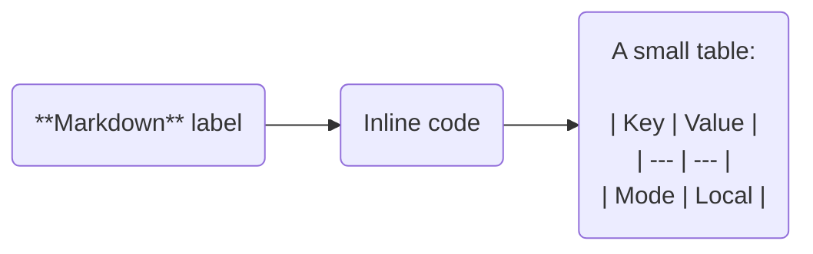

# merhmaid-renderer

A browser-based renderer for Mermaid flowcharts with Markdown-rich node labels, inspired by [Obsidian Mehrmaid](https://github.com/huterguier/obsidian-mehrmaid).

Paste a diagram, render it locally in the browser, and export the result as SVG or PNG. No backend or build step is required.

## Features

- Supports Mermaid `graph` and `flowchart` diagrams
- Renders Markdown inside double-quoted node labels
- Sanitizes rendered label HTML with DOMPurify
- Exports diagrams as SVG or high-resolution PNG
- Supports `Ctrl+Enter` and `Cmd+Enter` to render
- Deploys as a static site on GitHub Pages

## Example



Only double-quoted flowchart node labels are processed as Markdown. Other quoted Mermaid values, including subgraph titles and configuration values, are left unchanged.

## Run locally

Serve the repository over HTTP:

```bash
python -m http.server 8000
```

Open `http://localhost:8000`.

Opening `index.html` directly through `file://` is not supported because the application uses ES modules.

## Runtime dependencies

- Mermaid 11.15.0 is loaded from jsDelivr, with unpkg as a fallback.
- Marked and DOMPurify are vendored in the repository.
- Diagram source is processed in the browser and is not sent to an application backend.

## Limitations

- Mehrmaid-style Markdown processing currently supports only Mermaid flowcharts.
- PNG export of labels containing remote images can be blocked by the image host's CORS policy.
