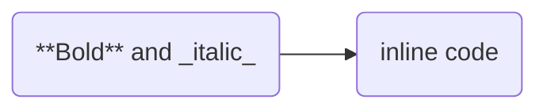

# mehrmaid-online

A minimal static GitHub Pages app for rendering [Mehrmaid](https://github.com/huterguier/obsidian-mehrmaid)-style flowcharts in the browser.

## Features

- Paste Mermaid `graph` or `flowchart` source
- Render Markdown inside quoted node labels
- Sanitize rendered Markdown before inserting it into the diagram
- Download the rendered diagram as SVG or PNG
- Render with `Ctrl+Enter` or `Cmd+Enter`

## Run locally

Serve the repository over HTTP. ES modules are not reliably supported when `index.html` is opened directly from `file://`.

```bash
python -m http.server 8000
```

Then open `http://localhost:8000`.

The app keeps Marked and DOMPurify vendored locally. Mermaid 11.15.0 is loaded at runtime from jsDelivr, with unpkg as a fallback, because Mermaid's ESM distribution requires a large dynamic-import chunk tree that was missing from the original repository.

## Supported syntax

Mehrmaid processing is limited to quoted labels attached to Mermaid flowchart nodes, for example:



Other quoted Mermaid values, such as subgraph titles and configuration values, are left unchanged.
